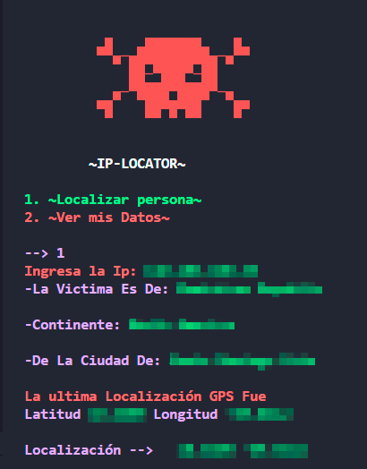

<h1 align=center style="color: #ff5733;">~Ip-Locator~</h1>

IP Locator es una herramienta de línea de comandos desarrollada en Python que te permite localizar y obtener información detallada sobre una dirección IP pública o ver datos relacionados con tu propia IP pública de forma rápida y sencilla. La herramienta se integra con fuentes de datos en línea para recopilar información precisa y en tiempo real.

<h2>
Paquetes Necesarios
</h2>

`pip install colorama`

`pip install colorama`

<h2>
Utilidad
</h2>

* Ejecuta el programa y selecciona entre dos opciones en el menú: localizar una dirección IP específica o ver datos relacionados con tu propia IP pública.
* Proporciona una dirección IP o utiliza la dirección IP pública predeterminada para obtener información detallada.
* La información se muestra de forma ordenada y legible en la línea de comandos, lo que facilita su comprensión.

<h2>
En ejecución
</h2>

  

